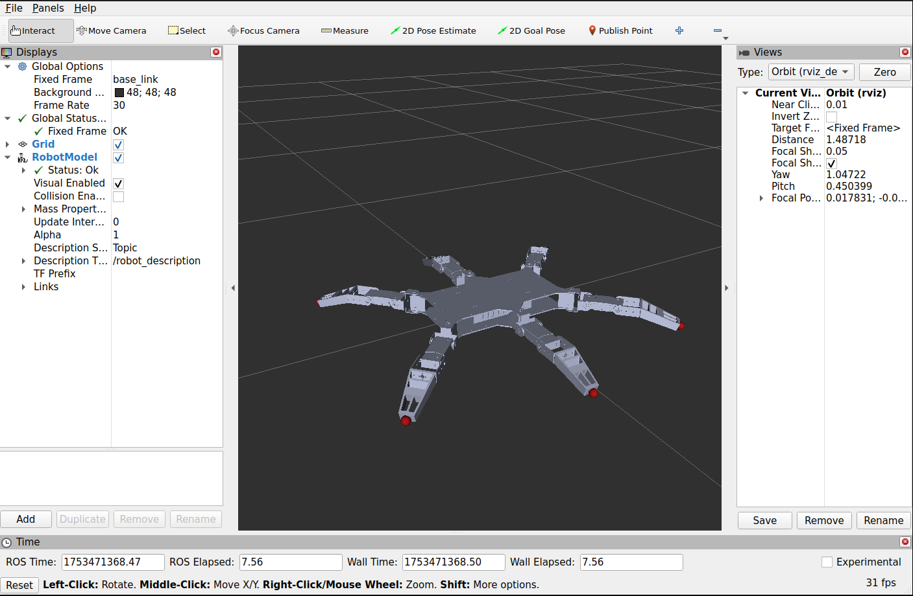
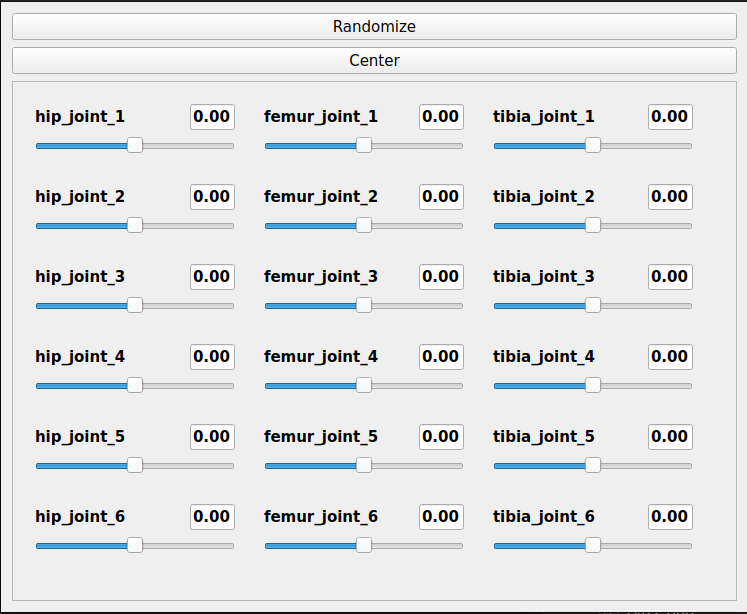

# 🐜 Six-Legged Robot Description – ROS 2 Package

This package provides the URDF/Xacro-based description of a six-legged (hexapod) robot and includes a launch file to visualize the robot using **RViz2** and interact with it using the **Joint State Publisher GUI**.

---

## 📁 Package Contents

```
six_legged_robot_description/
├── urdf/
├── └── macros                        # Xacro-macro files
│   └── six_legged_robot.xacro        # Main robot description file
├── rviz2/
│   └── default.rviz                  # Preconfigured RViz layout
├── launch/
│   └── rviz2.launch.py               # Launch file for RViz visualization
├── meshes/
│   └── full                          # Full meshes (both Solidworks and STL)
│   └── simplified                    # Simplified meshes (both Solidworks and STL)
├── CMakeLists.txt
├── LICENSE
├── package.xml
└── README.md
```

---

## 🧠 Features

- ✅ Modular and parameterized Xacro description
- ✅ Supports toggling **simplified meshes** for faster visualization
- ✅ Option to include/exclude **joint dynamics**
- ✅ Launches RViz2 and Joint State Publisher GUI for easy control and inspection

---

## 📷 Screenshots

### 🔍 RViz2 Visualization



---

### 🎛️ Joint State Publisher GUI



---

## ⚙️ Parameters

The launch file accepts the following arguments:

| Argument               | Default   | Description                                        |
| ---------------------- | --------- | -------------------------------------------------- |
| `simplify_meshes`    | `false` | Use simplified visual meshes to improve RViz speed |
| `use_joint_dynamics` | `true`  | Include inertial, damping, and friction properties |

---

## 🛠️ Build Instructions

Follow these steps to build the package inside a ROS 2 workspace:

```bash
# Create a ROS2 workspace if you dont have one
mkdir -p /ros2_ws/src
cd ~/ros2_ws/src

# Clone this package
git clone https://github.com/yourusername/six_legged_robot_description.git

cd ~/ros2_ws
```

```bash
# Optionally, you can check dependencies using rosdep
rosdep install --from-paths src -y --ignore-src
```

```bash
# Build the workspace
colcon build --symlink-install --packages-select six_legged_robot_description
```

> 🔧 Make sure you have `xacro`, `robot_state_publisher`, `joint_state_publisher_gui` and `rosdep` (**optionally**) installed.

---

## 🌐 Source the Workspace

Before launching anything, source the workspace:

```bash
source ~/ros2_ws/install/setup.bash
```

> You can add this to your `.bashrc` for convenience.

---

## 🚀 Launch the Visualization

To launch RViz2 with the robot description:

```bash
ros2 launch six_legged_robot_description rviz2.launch.py
```

### 🔄 Optional Launch Arguments

You can pass launch arguments like this:

```bash
ros2 launch six_legged_robot_description rviz2.launch.py simplify_meshes:=true use_joint_dynamics:=false
```

---

## 📌 TODOs

- [ ] Add real sensor plugins and simulation support (e.g., Gazebo or Isaac Sim)
- [ ] Add controller configuration for ROS 2 Control
- [ ] Make the robot walk
- [ ] Create DRL environment and agent, that learns how to control the robot

---

## 📄 License

This project is licensed under the [MIT License](LICENSE)

---

## 🤝 Contributions

PRs are welcome! Please open an issue first to discuss major changes.

---

## 📬 Contact

Author: **Nikita Mazhuga**
Email : [mazhuga.nikita@icloud.com](mailto:mazhuga.nikita@icloud.com)

---
